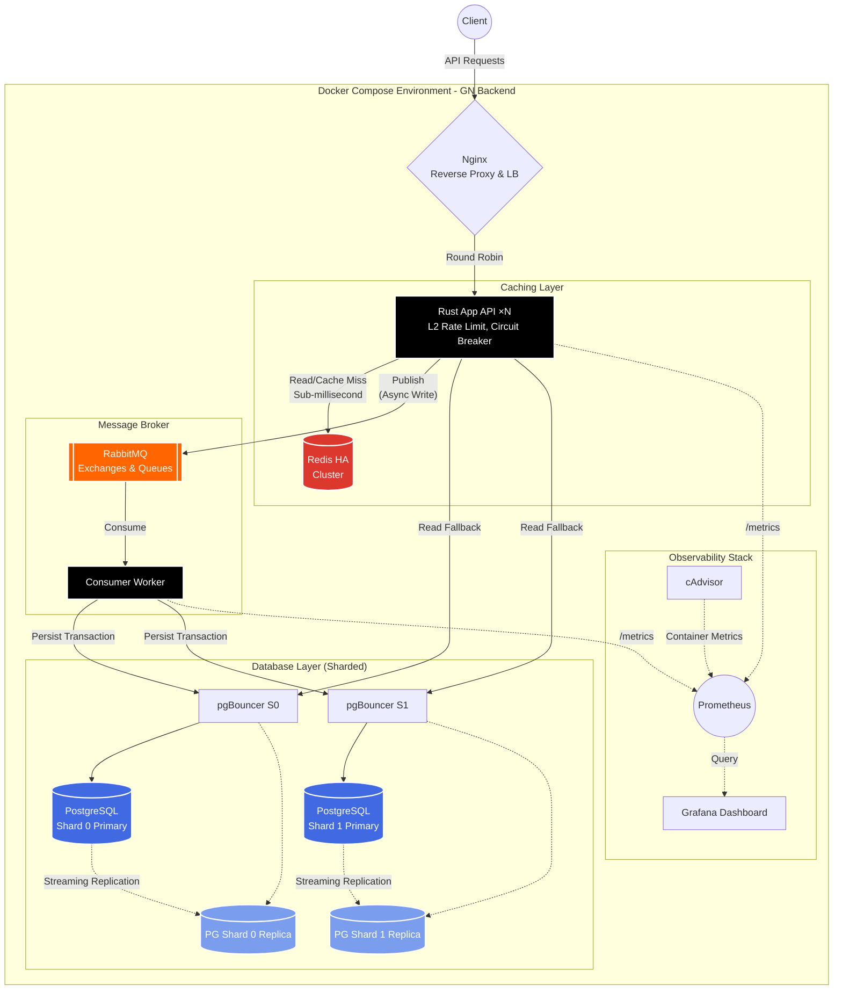

<<<<<<< HEAD
<div align="center">

# ⚡ Exploding User Data Scalabilities

**High-performance transaction processing backend built with Rust**

Engineered to handle **1 million transactions per hour** with built-in resilience, caching, and observability.

[](https://www.rust-lang.org/)
[](https://www.docker.com/)
[](https://www.postgresql.org/)
[](https://redis.io/)
[](https://www.rabbitmq.com/)
[](https://prometheus.io/)
[](https://grafana.com/)

</div>

---

## 📋 Table of Contents

- [Overview](#-overview)
- [Architecture](#-architecture)
- [Tech Stack](#-tech-stack)
- [Project Structure](#-project-structure)
- [Getting Started](#-getting-started)
- [API Reference](#-api-reference)
- [Monitoring & Dashboards](#-monitoring--dashboards)
- [Load Testing](#-load-testing)
- [Resilience Mechanisms](#-resilience-mechanisms)
- [Configuration](#-configuration)
- [Contributing](#-contributing)
- [License](#-license)

---
=======
Project: Exploding User Data Scalabilities (Topik B.4)
"Built for Speed, Designed for Resilience."
Repository ini berisi arsitektur dan implementasi prototype sistem manajemen beban puncak (Peak Load) yang mampu menangani lonjakan trafik secara efisien dan aman.

🛡️ Key Features:
High Performance: Backend menggunakan Rust (Axum & Tokio) untuk efisiensi memori dan latensi rendah.
Resilience: Proteksi berlapis dengan Rate Limiting, Circuit Breaker, dan Dead Letter Queue (DLQ).
Data Integrity: Mengimplementasikan Idempotency Key dan Asynchronous Processing via RabbitMQ.
High Availability: Database PostgreSQL dengan konfigurasi 1 Primary & 2 Replicas serta mekanisme Failover/Promotion.
Full Observability: Monitoring real-time menggunakan Prometheus & Grafana (Metrics, Logs, Tracing).

📊 SLO Targets:
Availability: 99.0%
Latency: P95 < 500ms
Error Budget: 100 Failed Transactions per 1M Request
>>>>>>> parent of 56be1b3 (Revise README with project details and features)

## 🎯 Overview

GN Backend is a **production-grade transaction processing system** designed for extreme throughput and reliability. It demonstrates modern backend engineering patterns in Rust:

- **~280 TPS sustained** (1M+ transactions/hour)
- **Sub-millisecond cache reads** via Redis
- **Async transaction processing** via RabbitMQ with dead-letter queues
- **Read/write database separation** with streaming replication
- **Multi-layer resilience** — rate limiting, circuit breaker, backpressure
- **Full observability** — Prometheus metrics, Grafana dashboards, structured JSON logging
- **100% containerized** — single `docker-compose up` deploys everything

---

## 🏗 Architecture



### Request Flow

1. **Nginx** receives the request → applies L1 rate limiting → load balances across app replicas
2. **Rust App** applies L2 rate limiting (per-IP token bucket) → circuit breaker → backpressure check
3. **Write path** — `POST /api/v1/transactions` → validates → publishes to RabbitMQ → returns `202 Accepted`
4. **Read path** — `GET /api/v1/transactions/:id` → checks Redis cache → falls back to read replica → populates cache
5. **Background worker** — consumes from RabbitMQ → writes to PostgreSQL primary → ACKs message (NACK → DLQ on failure)

---

## 🛠 Tech Stack

| Layer | Technology | Purpose |
|-------|-----------|---------|
| **Language** | Rust | Memory-safe, zero-cost abstractions |
| **Memory Allocator** | mimalloc | Faster memory allocation under concurrency |
| **HTTP Framework** | Axum 0.8 | Async, ergonomic HTTP server |
| **Async Runtime** | Tokio | Multi-threaded work-stealing runtime |
| **Database** | PostgreSQL 17 (2 Shards) | ACID-compliant, horizontally sharded DB |
| **DB Driver** | SQLx 0.8 | Async, compile-time verified queries |
| **Connection Pool** | pgBouncer | Transaction-mode pooling (per shard) |
| **Cache** | Redis 7 (HA) | In-memory cache with Sentinel failover |
| **Message Queue** | RabbitMQ 4 | Async processing + dead-letter queue |
| **AMQP Client** | amqprs 2.x | Native Tokio async AMQP client |
| **Middleware** | Tower | Rate limiter, circuit breaker, backpressure |
| **Metrics** | metrics + prometheus exporter | Request counts, latency histograms |
| **Monitoring** | Prometheus, Grafana, cAdvisor | Scraping, visualization, and container stats |
| **Load Testing** | k6 | Multi-scenario performance testing |
| **Reverse Proxy** | Nginx 1.27 | Rate limiting, load balancing, gzip |
| **Deployment** | Docker Compose | Single-command full stack deployment |

---

## 📁 Project Structure

```
.
├── src/
│   ├── main.rs                    # Entry point, router, middleware stack
│   ├── config.rs                  # Environment-based configuration
│   ├── error.rs                   # Centralized error handling (→ HTTP responses)
│   ├── api/
│   │   ├── mod.rs
│   │   ├── handlers.rs            # Transaction CRUD, health, metrics endpoints
│   │   └── responses.rs           # Standard API response wrappers
│   ├── db/
│   │   ├── mod.rs
│   │   ├── pool.rs                # Read/write separated database pools
│   │   ├── shard.rs               # Sharding logic and routing
│   │   └── models.rs              # Transaction models (SQLx ↔ JSON)
│   ├── cache/
│   │   ├── mod.rs
│   │   └── redis.rs               # Cache-aside pattern (get/set/delete)
│   ├── queue/
│   │   ├── mod.rs
│   │   ├── producer.rs            # RabbitMQ publisher + exchange/queue setup
│   │   └── consumer.rs            # Async consumer worker (ACK/NACK/DLQ)
│   └── middleware/
│       ├── mod.rs
│       ├── rate_limit.rs           # Per-IP token bucket rate limiter
│       ├── circuit_breaker.rs      # Closed → Open → HalfOpen circuit breaker
│       ├── backpressure.rs         # Concurrency limiter with load shedding
│       ├── metrics.rs              # Prometheus metrics collector middleware
│       └── request_id.rs           # Request ID injection and tracking
├── db/
│   ├── init.sql                   # Schema with optimized indexes
│   ├── primary-setup.sh           # PostgreSQL replication setup
│   └── replica-entrypoint.sh      # Streaming replica bootstrap
├── nginx/
│   └── nginx.conf                 # Rate limiting, load balancing, gzip
├── prometheus/
│   └── prometheus.yml             # Scrape config for app replicas
├── grafana/
│   ├── provisioning/
│   │   ├── datasources/prometheus.yml
│   │   └── dashboards/dashboards.yml
│   └── dashboards/
│       └── gn-backend.json        # Pre-built performance dashboard (9 panels)
├── k6/
│   └── load-test.js               # Load test: smoke, load, stress, spike
├── Cargo.toml                     # Dependencies + release optimizations
├── Dockerfile                     # Multi-stage build (~30MB final image)
├── docker-compose.yml             # Full stack: 19 services
├── .env.example                   # Configuration template
├── .gitignore
├── LICENSE
└── README.md
```

---

## 🚀 Getting Started

### Prerequisites

- [Docker](https://docs.docker.com/get-docker/) (v20.10+)
- [Docker Compose](https://docs.docker.com/compose/install/) (v2.0+)
- ~4GB available RAM

### Quick Start

```bash
# 1. Clone the repository
git clone https://github.com/<your-username>/gn-backend.git
cd gn-backend

# 2. Create environment file
cp .env.example .env

# 3. Start all services
docker-compose up -d

# 4. Wait for healthy status (~30-60 seconds on first run)
docker-compose ps

# 5. Verify the server is running
curl http://localhost:8080/health
```

Expected health response:
```json
{
  "status": "healthy",
  "services": {
    "database_write": true,
    "database_read": true,
    "redis": true,
    "rabbitmq": true
  }
}
```

### Useful Commands

```bash
# View logs
docker-compose logs -f app

# Scale app replicas
docker-compose up -d --scale app=4

# Rebuild after code changes
docker-compose up -d --build

# Stop everything
docker-compose down

# Stop and remove all data volumes
docker-compose down -v
```

---

## 📡 API Reference

### Create Transaction

```bash
POST /api/v1/transactions
Content-Type: application/json

{
  "from_account": "ACC00001",
  "to_account": "ACC00002",
  "amount": 150000.50,
  "currency": "IDR",
  "description": "Payment for services"
}
```

Response (`202 Accepted`):
```json
{
  "success": true,
  "data": {
    "reference_id": "550e8400-e29b-41d4-a716-446655440000",
    "status": "accepted",
    "message": "Transaction queued for processing (shard 0)"
  }
}
```

### Get Transaction

```bash
GET /api/v1/transactions/:id
```

### List Transactions

```bash
GET /api/v1/transactions?limit=20&offset=0
```

### Health Check

```bash
GET /health
```

### Prometheus Metrics

```bash
GET /metrics
```

---

## 📊 Monitoring & Dashboards

### Access Points

| Service | URL | Credentials |
|---------|-----|-------------|
| **Grafana** | http://localhost:3001 | `admin` / `admin` |
| **Prometheus** | http://localhost:9090 | — |
| **RabbitMQ** | http://localhost:15672 | `gn_user` / `gn_secure_pass` |

### Grafana Dashboard

A pre-built **GN Backend — Performance Dashboard** is automatically provisioned with 9 panels:

| Panel | Type | Description |
|-------|------|-------------|
| Request Rate | Time Series | req/s by method, path, status |
| Response Time | Time Series | p50, p95, p99 latency |
| Transactions Created | Stat | Total created counter |
| Transactions Processed | Stat | Total processed by worker |
| Circuit Breaker State | Stat | 0=Closed, 1=Open, 2=Half-Open |
| In-Flight Requests | Gauge | Current concurrent requests |
| Rate Limited | Bar Chart | Requests rejected by rate limiter |
| Load Shed | Bar Chart | Requests rejected by backpressure |
| Cache Hit Rate | Time Series | Redis cache effectiveness |

### Key Prometheus Metrics

| Metric | Type | Labels |
|--------|------|--------|
| `http_requests_total` | Counter | method, path, status |
| `http_request_duration_seconds` | Histogram | method, path |
| `transactions_created_total` | Counter | — |
| `transactions_processed_total` | Counter | — |
| `cache_hits_total` | Counter | — |
| `cache_misses_total` | Counter | — |
| `rate_limited_total` | Counter | — |
| `backpressure_shed_total` | Counter | — |
| `backpressure_in_flight` | Gauge | — |
| `circuit_breaker_state` | Gauge | — |

---

## 🧪 Load Testing

### Prerequisites

Install [k6](https://k6.io/docs/get-started/installation/):

```bash
# macOS
brew install k6

# Windows (winget)
winget install k6

# Docker (alternative)
docker run --rm -i grafana/k6 run - < k6/load-test.js
```

### Run Tests

```bash
# Run all scenarios (smoke → load → stress → spike)
k6 run k6/load-test.js

# Run with custom target
k6 run --env BASE_URL=http://localhost:8080 k6/load-test.js

# Run specific scenario only
k6 run --scenario smoke k6/load-test.js

# Export results to JSON
k6 run --out json=k6/output/results.json k6/load-test.js

# Run 1 million transactions per hour test (sustained 278 TPS for 15+ mins)
k6 run k6/load-test-1m.js
```

### Test Scenarios

| Scenario | Virtual Users | Duration | Purpose |
|----------|:------------:|----------|---------|
| **Smoke** | 10 | 30s | Verify system works |
| **Load** | 0 → 500 | 7min | Sustained target throughput |
| **Stress** | 0 → 1,000 | 3min | Find breaking point |
| **Spike** | 50 → 2,000 | 50s | Test sudden traffic burst |
| **1M/Hour Sustained** | up to 1,500 | 15m+ | Guarantee 1 Million Transactions / hour (~278 TPS) |

### Thresholds

- **p95 response time** < 100ms
- **p99 response time** < 400ms
- **Error rate** < 0.01%

---

## 🛡 Resilience Mechanisms

### 1. Rate Limiting (2 Layers)

| Layer | Engine | Config |
|-------|--------|--------|
| **L1** | Nginx | 500 req/s per IP, 10,000 req/s global burst |
| **L2** | Rust (Token Bucket) | Configurable per-IP rate + burst |

### 2. Circuit Breaker

```
  ┌─────────┐  failure >= threshold  ┌──────────┐  timeout elapsed  ┌───────────┐
  │ CLOSED  │ ─────────────────────→ │   OPEN   │ ────────────────→ │ HALF-OPEN │
  │(normal) │                        │ (reject) │                   │  (probe)  │
  └─────────┘ ←───────────────────── └──────────┘ ←──────────────── └───────────┘
               recovery success                     any failure
```

### 3. Backpressure / Load Shedding

Limits concurrent in-flight requests. When the limit is reached, new requests receive `503 Service Unavailable` immediately — keeping the system responsive for existing requests.

### 4. Dead Letter Queue

Failed messages are routed to a dedicated DLQ (`transactions.dead_letter`) for investigation and replay, ensuring zero message loss.

---

## ⚙ Configuration

All configuration is via environment variables. Copy `.env.example` to `.env`:

```bash
cp .env.example .env
```

| Variable | Default | Description |
|----------|---------|-------------|
| `APP_HOST` | `0.0.0.0` | Bind address |
| `APP_PORT` | `3000` | HTTP port |
| `DATABASE_SHARD0_WRITE_URL` | — | PostgreSQL Shard 0 primary connection |
| `DATABASE_SHARD0_READ_URLS` | — | PostgreSQL Shard 0 replica connections (comma-separated) |
| `DATABASE_SHARD1_WRITE_URL` | — | PostgreSQL Shard 1 primary connection |
| `DATABASE_SHARD1_READ_URLS` | — | PostgreSQL Shard 1 replica connections (comma-separated) |
| `REDIS_URL` | — | Redis master connection |
| `REDIS_READ_URL` | — | Redis replica connection |
| `RABBITMQ_URL` | — | RabbitMQ AMQP connection |
| `DB_WRITE_POOL_SIZE` | `25` | Write pool connections |
| `DB_READ_POOL_SIZE` | `50` | Read pool connections |
| `REDIS_POOL_SIZE` | `50` | Redis pool connections |
| `RATE_LIMIT_PER_SECOND` | `5000` | L2 rate limit per IP |
| `RATE_LIMIT_BURST` | `10000` | L2 burst allowance |
| `CIRCUIT_BREAKER_FAILURE_THRESHOLD` | `50` | Failures before opening |
| `CIRCUIT_BREAKER_RECOVERY_TIMEOUT_SECS` | `30` | Seconds before half-open |
| `MAX_CONCURRENT_REQUESTS` | `5000` | Backpressure limit |

---

## 🤝 Contributing

1. Fork the repository
2. Create a feature branch (`git checkout -b feature/amazing-feature`)
3. Commit your changes (`git commit -m 'Add amazing feature'`)
4. Push to the branch (`git push origin feature/amazing-feature`)
5. Open a Pull Request

---

## 📄 License

This project is licensed under the MIT License — see the [LICENSE](LICENSE) file for details.
