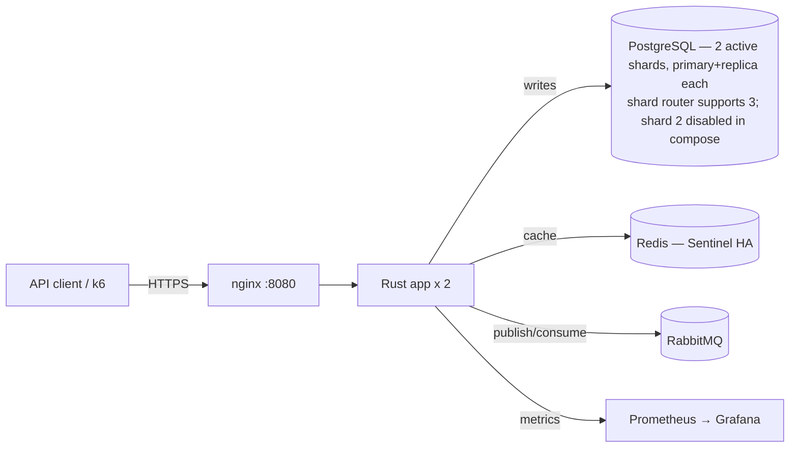
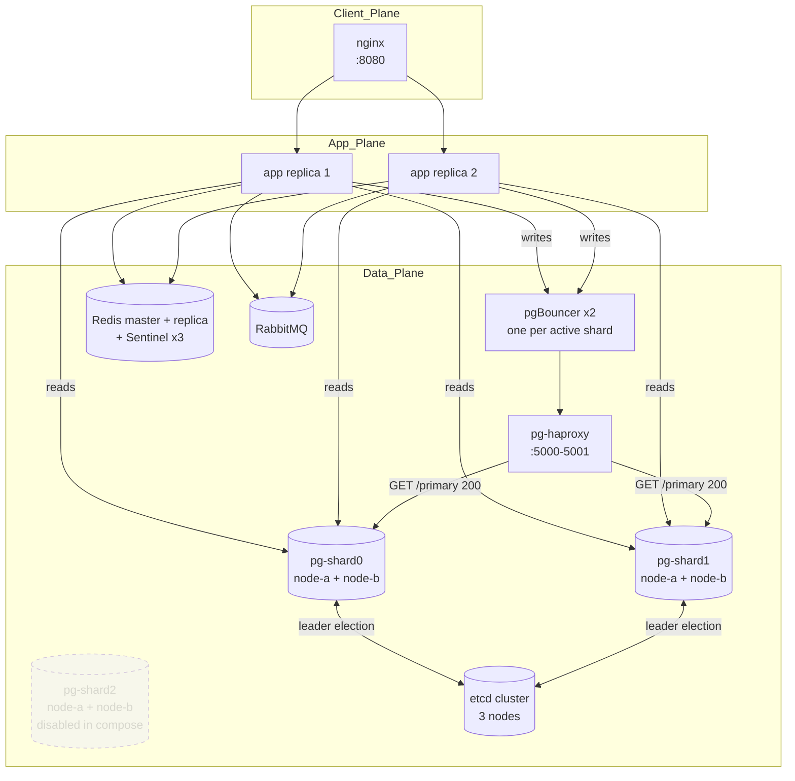
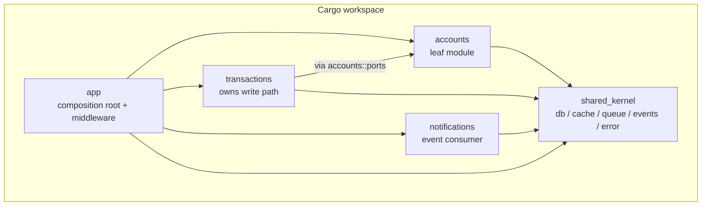

# Architecture Overview

This is the **single living overview** of the Peakload system. It tells
you what the system is, how the pieces fit, and where to look for
deeper detail. For *why* a given choice was made, follow the link to
the relevant [Architecture Decision Record](adr/).

> **Audience:** anyone joining the project. Read top to bottom once;
> refer back to specific sections later.

---

## 1. What it is

A peak-load handling backend for high-volume money-movement traffic.
Single Rust binary, deployed as two replicas behind nginx.

**SLOs**

| Metric            | Target                                |
|-------------------|---------------------------------------|
| Availability      | 99.9%                                 |
| Latency           | P95 < 500 ms                          |
| Error budget      | ≤ 100 failed transactions / 1M req    |

---

## 2. Context (C4 level 1)



The client speaks HTTPS to nginx, which load-balances across two
stateless Rust replicas. The replicas share **two active Postgres
shards** (each a primary + replica pair under Patroni — see
[ADR-0005](adr/0005-patroni-over-pg-auto-failover.md)); the shard
router code supports three but the third shard is commented out
in compose for capstone-host capacity (see
[docker-compose.yml](../docker-compose.yml) lines 7 + 54). The
replicas also share a Redis HA pair fronted by Sentinel and a
RabbitMQ broker.

---

## 3. Containers (C4 level 2)



> The shard-router code (`ShardRouterConfig::shards`) supports an
> arbitrary number of shards. Shard 2 is declared in the topology but
> its compose stanza is commented out for capstone-host capacity (see
> [docker-compose.yml](../docker-compose.yml) lines 7 + 54). Re-enabling
> is a single uncomment + `docker compose up -d` step.

- **Writes** go through pgBouncer → HAProxy → whichever node serves
  `GET /primary 200` (see [ADR-0006](adr/0006-haproxy-primary-routing.md)).
- **Reads** bypass HAProxy and round-robin across both nodes of each
  shard with per-replica health flags
  ([`crates/shared_kernel/src/db/pool.rs`](../crates/shared_kernel/src/db/pool.rs)).
- **Failover window**: 5–15 s for primary loss. The app's transient-error
  retry wrapper ([`shared_kernel/db/failover.rs`](../crates/shared_kernel/src/db/failover.rs))
  soaks the window for idempotent writes.

---

## 4. Components — module crates (C4 level 3)



The dependency graph is **enforced by Cargo** (see
[ADR-0002](adr/0002-cargo-workspace-split.md)). A forbidden import
across crate boundaries is a compile error, not a code-review comment.

Each module crate has the same internal shape — see
[ADR-0003](adr/0003-port-adapter-shape.md) and the copy-able template
at [`docs/architecture/module-template/`](architecture/module-template/).

| Crate                                                   | Owns                                               | Depends on                |
|---------------------------------------------------------|----------------------------------------------------|---------------------------|
| [`crates/accounts`](../crates/accounts/README.md)       | `users` table, balance reads                       | `shared_kernel`           |
| [`crates/transactions`](../crates/transactions/README.md) | `transactions` + `idempotency_keys`, AMQP consumer | `shared_kernel`, `accounts` (ports) |
| [`crates/notifications`](../crates/notifications/README.md) | in-memory notification log, dispatch policy      | `shared_kernel` only      |
| [`crates/shared_kernel`](../crates/shared_kernel)       | sqlx pool, shard router, Redis cache, AMQP producer, event bus, error type, response helpers | — |
| [`crates/app`](../crates/app)                           | composition root, bootstrap, config, middleware, `/health`, `/metrics` | all of the above          |

---

## 5. Runtime — write path

```mermaid
sequenceDiagram
    participant C as Client
    participant N as nginx
    participant H as transactions::api::handlers
    participant S as TransactionService
    participant Q as RabbitMQ producer
    participant K as Consumer (transactions::infrastructure)
    participant DB as Postgres (shard N)
    participant E as InProcessEventBus
    participant Notif as notifications

    C->>N: POST /api/v2/transactions
    N->>H: forward
    H->>S: create(input)
    S->>S: idempotency check (Redis + idempotency_keys)
    S->>Q: publish(transactions exchange)
    S-->>H: 202 Accepted
    H-->>N: 202 + reference_id
    N-->>C: 202

    K->>Q: consume batch
    K->>DB: BEGIN; insert tx + update balances; COMMIT
    K->>E: publish TransactionCommitted
    E-->>Notif: subscriber wakes
    Notif->>Notif: append to ring buffer
```

- **Idempotency** is keyed `txn:<shard>:<reference_id>`. Same key →
  same outcome, regardless of retry count or path (Redis fast-path
  short-circuits before the DB write).
- **Cross-shard reads** (`get_by_id`, `list`) fan out N parallel
  queries (one per shard); first-hit wins for `find_by_id`, list
  merges and re-sorts.
- **Events** use the in-process bus by default — see
  [ADR-0004](adr/0004-in-process-event-bus.md). Swap surface for an
  AMQP-backed transport is two trait impls in `shared_kernel::events`.

---

## 6. Cross-cutting concerns

**Middleware stack — request-inbound order** (this is the order a
request hits each layer on its way to the handler; the
[`apply_protection_stack`](../crates/app/src/bootstrap.rs) Tower
`.layer()` calls appear in the *reverse* of this list, because each
`.layer()` wraps the previous):

```
client request
  ↓ TraceLayer                   (span creation, outermost)
  ↓ TimeoutLayer + HandleError   (api_timeout_secs)
  ↓ request_id                   (inject / echo X-Request-Id)
  ↓ backpressure                 (concurrent-request semaphore)
  ↓ circuit_breaker              (per-route trip on 5xx)
  ↓ rate_limit                   (per-IP token bucket via Redis)
  ↓ auth                         (JWT pin'd HS256, optional via ENABLE_AUTH)
  ↓ degradation                  (R-9 write-method 503 in read_only mode)
  ↓ metrics                      (innermost — counter + histogram)
  ↓ handler
```

This is the single canonical statement of middleware order in this
repo. Per-crate READMEs link here rather than re-listing it to avoid
the drift this doc previously carried (DOC-9 in
[the docs audit](audit/2026-05-16-phase2-documentation.md#doc-9--middleware-order-documented-two-different-ways)).

| Concern             | Where                                                               |
|---------------------|---------------------------------------------------------------------|
| Auth                | `crates/app/src/middleware/`                                        |
| Rate limit          | `shared_kernel::rate_limit::PerKeyBucket` + middleware              |
| Circuit breaker     | `shared_kernel::circuit_breaker` + middleware                       |
| Backpressure        | `crates/app/src/middleware/backpressure.rs`                         |
| Idempotency         | `crates/transactions/src/application` (DB row + Redis fast-path)    |
| Observability       | Prometheus metrics, request-id propagation, structured tracing      |

---

## 7. Key constraints & failure modes

- **Failover window 5–15 s.** Transient errors during a Patroni
  promotion are retried by `shared_kernel::db::failover::retry_transient`.
  Sized the retry budget in `.env.example` to soak this window.
- **etcd quorum loss demotes all primaries to read-only.** Deliberate:
  data safety wins over availability. Mitigation = run etcd nodes on
  separate hosts in production.
- **`tokio::broadcast` drops on laggy receivers.** Notifications are
  best-effort; subscribers count drops via metrics.
- **Notifications are in-memory only.** Restart loses recent history
  (capped 512-entry ring buffer). Persistent log is deferred —
  ADR-0004.

---

## 8. Where things live

```
crates/                                 Rust workspace (ADR-0002)
├── app/                                composition root + middleware
├── shared_kernel/                      cross-cutting infra
├── accounts/    transactions/    notifications/    business modules
├── */src/{domain,application,infrastructure,api}/  per ADR-0003
└── */src/ports.rs                      cross-module contract

db/
├── bootstrap/                          schema migrations
└── patroni/                            HA orchestrator (ADR-0005)

haproxy/                                primary-router config (ADR-0006)
nginx/                                  edge load balancer
docs/
├── architecture.md                     ← this file
├── adr/                                decision records
├── architecture/module-template/       copy-this skeleton for new modules
└── apiContract.yaml                    OpenAPI 2.0
k6/                                     load test scripts
```

---

## 9. Where to go next

| Question                                              | Read                                                 |
|-------------------------------------------------------|------------------------------------------------------|
| What does *this module* do?                           | The crate's `README.md` (one-page card)              |
| Why is *this thing* the way it is?                    | [`docs/adr/`](adr/)                                  |
| How do I create a new module?                         | Copy [`docs/architecture/module-template/`](architecture/module-template/) |
| What endpoints exist?                                 | [`docs/apiContract.yaml`](apiContract.yaml)          |
| How do I run the stack?                               | Root [`README.md`](../README.md)                     |
| How does failover actually work?                      | [ADR-0005](adr/0005-patroni-over-pg-auto-failover.md) + [ADR-0006](adr/0006-haproxy-primary-routing.md) |
