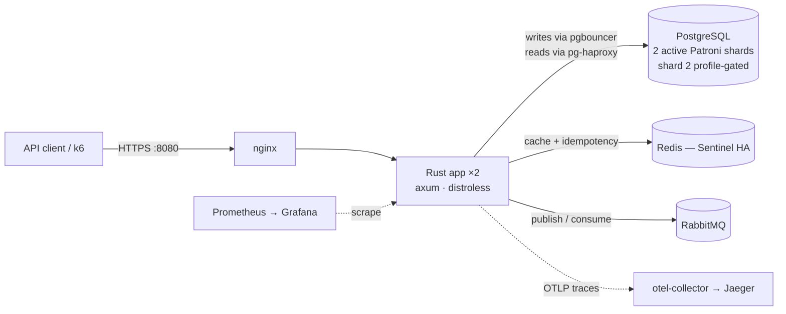
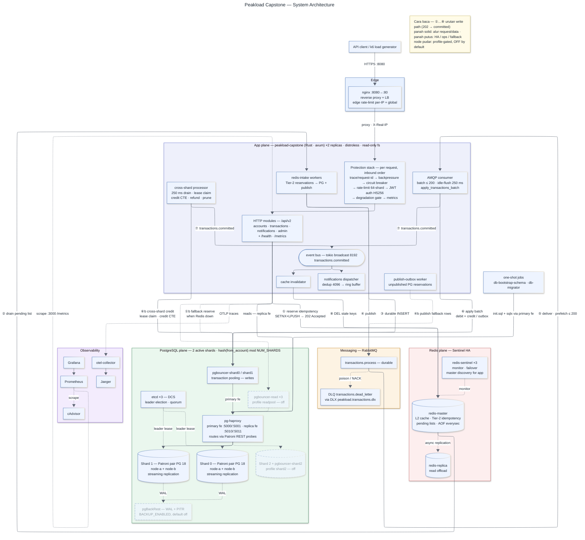
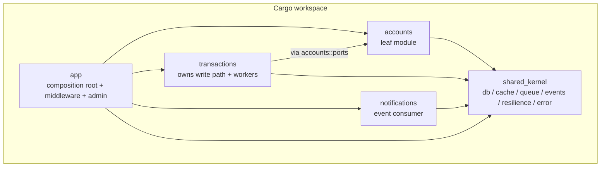

# Architecture Overview

This is the **single living overview** of the Peakload system. It tells
you what the system is, how the pieces fit, and where to look for
deeper detail. For *why* a given choice was made, follow the link to
the relevant [Architecture Decision Record](adr/). For a clickable
step-by-step trace of each runtime flow, open
[`docs/codemap/codemap.html`](codemap/codemap.html) in a browser; for
an interactive diagram of the whole system (topology, protection
stack, write/read paths, HA, observability — every component clickable
with verified facts and code refs), open
[`docs/architecture/architecture.html`](architecture/architecture.html).
For an **animated traffic tour** (unified mega map — topology, protection
stack, write/read paths on one canvas; traffic scenarios with step
narration and auto-zoom into containers), open
[`docs/architecture/architecture-tour.html`](architecture/architecture-tour.html).

> **Audience:** anyone joining the project. Read top to bottom once;
> refer back to specific sections later.
>
> **Freshness:** every claim below was re-verified against
> `docker-compose.yml`, `.env.example`, and `crates/*` on 2026-06-10.

---

## 1. What it is

A peak-load handling backend for high-volume money-movement traffic.
Single Rust binary (axum), deployed as **two replicas** behind nginx,
with sharded Postgres under Patroni HA, Redis Sentinel, and RabbitMQ.

**SLOs**

| Metric            | Target                                |
|-------------------|---------------------------------------|
| Availability      | 99.9%                                 |
| Latency           | P95 < 500 ms                          |
| Error budget      | ≤ 100 failed transactions / 1M req    |

---

## 2. Context (C4 level 1)



The client speaks HTTPS to nginx (edge rate-limit per-IP + global),
which load-balances across two stateless Rust replicas. The replicas
share **two active Postgres shards** — each a primary + replica pair
under Patroni ([ADR-0005](adr/0005-patroni-over-pg-auto-failover.md))
with a 3-node etcd cluster as the DCS. Shard count is driven by
`COMPOSE_PROFILES` in `.env` (default `shard1,prometheus,grafana` =
shards 0+1 active; a third shard ships in compose behind the `shard2`
profile). The replicas also share a Redis master/replica pair fronted
by 3 Sentinels and one RabbitMQ broker.

---

## 3. Whole-system diagram (C4 level 2)

The comprehensive container-level diagram lives in
[`docs/architecture/system-overview.mmd`](architecture/system-overview.mmd)
(standalone Mermaid, reusable in slides/reports) and is embedded here.
Follow the circled numbers ①–⑧ for the write path; dashed arrows are
HA/ops/fallback paths; faded nodes are profile-gated and **off by
default**.



**How traffic reaches Postgres** (per shard *N* ∈ {0, 1}):

- **Writes**: app → `pgbouncer-shardN:5432` (transaction pooling —
  session GUCs must be set server-side, never via client `SET`) →
  `pg-haproxy:500N` primary frontend → whichever Patroni node answers
  `GET /primary 200` ([ADR-0006](adr/0006-haproxy-primary-routing.md)).
- **Reads**: app → `pg-haproxy:501N` replica frontend directly (no
  pooler). The optional `readpool` profile inserts
  `pgbouncer-read-shardN` in front for read pooling.
- **Failover window**: 5–15 s for primary loss, bounded by the etcd
  leader-lease TTL. The app soaks it with
  `shared_kernel::db::failover::retry_transient_with_breaker` (R-7
  per-dependency breaker: fail fast when the DB is known-down) plus
  per-replica health probes every `DB_HEALTH_CHECK_INTERVAL_SECS=5`.
- **Backup**: pgBackRest WAL archiving + PITR behind the
  `BACKUP_ENABLED` toggle (default off). See
  [disaster-recovery.md](disaster-recovery.md).

---

## 4. Components — module crates (C4 level 3)



The dependency graph is **enforced by Cargo** (see
[ADR-0002](adr/0002-cargo-workspace-split.md)). A forbidden import
across crate boundaries is a compile error, not a code-review comment.

Each module crate has the same internal shape — see
[ADR-0003](adr/0003-port-adapter-shape.md) and the copy-able template
at [`docs/architecture/module-template/`](architecture/module-template/).

| Crate                                                   | Owns                                               | Depends on                |
|---------------------------------------------------------|----------------------------------------------------|---------------------------|
| [`crates/accounts`](../crates/accounts/README.md)       | `users` table, balance reads (moka L1 + Redis L2 + DB) | `shared_kernel`       |
| [`crates/transactions`](../crates/transactions/README.md) | `transactions` + `idempotency_keys` + `cross_shard_outbox` tables; background workers: AMQP consumer, redis-intake, publish-outbox, cross-shard processor, cache invalidator, idempotency cleanup | `shared_kernel`, `accounts` (ports) |
| [`crates/notifications`](../crates/notifications/README.md) | in-memory notification log (512-entry ring buffer), dispatch policy | `shared_kernel` only |
| [`crates/shared_kernel`](../crates/shared_kernel)       | sqlx pools + shard router, Redis cache (Sentinel-aware), AMQP producer, event bus, R-7 dependency breakers, error type, response helpers | — |
| [`crates/app`](../crates/app)                           | composition root, bootstrap, config, protection-stack middleware, degradation flag, admin API, `/health`, `/metrics` | all of the above |

---

## 5. Runtime — write path

```mermaid
sequenceDiagram
    autonumber
    participant C as Client
    participant H as transactions handler
    participant R as Redis (Tier-2)
    participant W as redis-intake worker
    participant PG as PG shard N (via pgbouncer)
    participant Q as RabbitMQ
    participant K as AMQP consumer
    participant B as event bus
    participant I as cache invalidator

    C->>H: POST /api/v2/transactions
    H->>H: validate → shard, idempotency_key, SHA-256 request_hash
    H->>R: SETNX reservation + LPUSH pending
    R-->>H: Reserved / Replay / HashConflict
    H-->>C: 202 Accepted (Replay = same 202; HashConflict = 4xx)

    W->>R: drain pending list (batched)
    W->>PG: INSERT idempotency_keys + outbox payload
    W->>Q: publish transactions.process

    K->>Q: consume — prefetch ≤200, size-flush at 200 or idle-flush 250 ms
    K->>PG: apply_transactions_batch — bulk claim (ON CONFLICT) + debit + same-shard credit / cross-shard outbox
    K-->>Q: ACK / NACK→DLQ per delivery tag
    K->>B: transactions.committed
    B->>I: event fan-out (also → notifications dispatcher)
    I->>R: DEL stale tx_status / balance keys

    Note over H,PG: Redis down → handler reserves durably in PG instead<br/>(Tier-3, INSERT ON CONFLICT); publish-outbox worker ships those rows.
    Note over PG: Cross-shard rows: a 250 ms processor lease-claims the outbox,<br/>applies an idempotent credit CTE on the receiver shard,<br/>then flips the sender audit row and emits the committed event.
```

- **Idempotency** is keyed `txn:<shard>:<reference_id>` with a SHA-256
  `request_hash` over all payload fields — same key + same hash
  replays the stored 202; same key + different hash is a 4xx conflict,
  never a silent replay.
- **Money safety**: the consumer re-derives the shard from
  `from_account` (wire field is advisory), debits with
  `UPDATE … WHERE balance >= amount`, and the cross-shard credit is
  guarded by a dedupe PK so redelivery can never double-credit.
  Refunds are compensating CTEs and are **never terminal-failed**.
- **Cross-shard reads** (`list`, `get_by_id`) fan out one query per
  shard; `list` merges with a safe-cursor algorithm that drops rows
  below the per-shard tail probe (D-3 defence).
- **Events** use the in-process bus —
  [ADR-0004](adr/0004-in-process-event-bus.md). Lossy by design;
  subscribers surface drops via `*_lagged_total` counters.

---

## 6. Cross-cutting concerns

**Middleware stack — request-inbound order.** Verified empirically
2026-06-10 with an axum `Router::layer` ordering probe (last-added
layer runs first):

```
client request
  ↓ CORS
  ↓ TraceLayer                   (http.request span)
  ↓ TimeoutLayer + HandleError   (api_timeout_secs)
  ↓ request_id                   (inject / echo X-Request-Id)
  ── per-module protection stack (apply_protection_stack) ──
  ↓ backpressure                 (semaphore, bounded 50 ms wait → 503)
  ↓ circuit_breaker              (trips on 5xx responses from inside)
  ↓ rate_limit                   (per-IP, 64-shard in-process + Redis sync)
  ↓ auth                         (JWT pinned HS256, ENABLE_AUTH gate)
  ↓ degradation                  (R-9: writes → 503 in read_only mode)
  ↓ metrics                      (innermost — RED for surviving traffic)
  ↓ handler
```

This is the single canonical statement of middleware order in this
repo; per-crate READMEs link here rather than re-listing it. Two
consequences worth knowing:

- **`http_requests_total` excludes shed traffic.** Requests rejected
  by the outer layers never reach the metrics layer; watch
  `rate_limited_total`, `backpressure_shed_total`,
  `circuit_breaker_state`, and `degradation_mode` for those.
- **Degraded writes feed the breaker.** The degradation gate sits
  *inside* the circuit breaker, so its 503s are classified as
  failures on the way out — sustained write traffic during a
  read-only window can trip the breaker and shed reads on the same
  module router.

| Concern                  | Where                                                                 |
|--------------------------|-----------------------------------------------------------------------|
| Auth                     | [`crates/app/src/middleware/auth.rs`](../crates/app/src/middleware/auth.rs) |
| Rate limit               | [`crates/app/src/middleware/rate_limit.rs`](../crates/app/src/middleware/rate_limit.rs) |
| HTTP circuit breaker     | [`crates/app/src/middleware/circuit_breaker.rs`](../crates/app/src/middleware/circuit_breaker.rs) |
| Per-dependency breakers  | [`crates/shared_kernel/src/resilience.rs`](../crates/shared_kernel/src/resilience.rs) (R-7) |
| Backpressure             | [`crates/app/src/middleware/backpressure.rs`](../crates/app/src/middleware/backpressure.rs) |
| Degradation (R-9)        | [`crates/app/src/degradation.rs`](../crates/app/src/degradation.rs) + `PUT /api/v2/admin/degradation` |
| Idempotency              | `crates/transactions` — Redis Tier-2 fast path + PG Tier-3 durable    |
| Observability            | Prometheus metrics, X-Request-Id propagation, OTLP traces → Jaeger    |

---

## 7. Key constraints & failure modes

- **Failover window 5–15 s.** Transient errors during a Patroni
  promotion are retried by `shared_kernel::db::failover`; the write
  retry budget (`DB_WRITE_RETRY_MAX_ATTEMPTS=6` × 200 ms backoff) is
  sized to soak this window.
- **etcd quorum loss demotes all primaries to read-only.** Deliberate:
  data safety wins over availability. Mitigation = run etcd nodes on
  separate hosts in production.
- **Tier-2 reservation durability is bounded by Redis AOF
  `everysec`** — ≤ 1 s of accepted-but-unpersisted reservations can be
  lost on a master crash. The durable Tier-3 PG path is the fallback,
  not the default, by throughput design.
- **`tokio::broadcast` drops on laggy receivers.** Notifications and
  cache invalidation are best-effort; drops are counted
  (`notifications_events_lagged_total`, `cache_invalidator_lagged_total`).
- **Notifications are in-memory only.** Restart loses recent history
  (512-entry ring buffer). Persistent log is deferred — ADR-0004.
- **pgBouncer transaction pooling on the write path** means session
  state (GUCs, prepared statements) cannot be set per-connection from
  the app; anything session-scoped must be set server-side.

---

## 8. Where things live

```
crates/                                 Rust workspace (ADR-0002)
├── app/                                composition root + middleware + admin
├── shared_kernel/                      cross-cutting infra (db/cache/queue/events/resilience)
├── accounts/    transactions/    notifications/    business modules
├── */src/{domain,application,infrastructure,api}/  per ADR-0003
└── */src/ports.rs                      cross-module contract

db/
├── init.sql                            schema + apply_transactions_batch fn
├── bootstrap/                          one-shot schema applier
├── migrations/                         sqlx migrations (db-migrator)
└── patroni/                            HA orchestrator image (ADR-0005)

haproxy/                                primary/replica router config (ADR-0006)
nginx/                                  edge LB + rate-limit template
redis/  prometheus/  otel/  grafana/    infra configs + dashboards
k6/                                     load test scripts (incl. nightly CI)
diag/                                   regression-hunt tooling (profile matrix)
deploy/                                 deployment assets
docs/
├── architecture.md                     ← this file
├── architecture/architecture.html     interactive architecture showpiece
├── architecture/architecture-tour.html traffic simulation tour (derived copy)
├── architecture/system-overview.mmd    reusable whole-system Mermaid
├── architecture/module-template/       copy-this skeleton for new modules
├── codemap/codemap.html                interactive per-flow code map
├── adr/                                decision records
├── runbooks/                           operational procedures
├── audit/                              audit reports + certification
├── disaster-recovery.md  residual-risks.md
└── apiContract.yaml                    OpenAPI 3.0.3
```

---

## 9. Where to go next

| Question                                              | Read                                                 |
|-------------------------------------------------------|------------------------------------------------------|
| What does the whole system look like, interactively?  | [`docs/architecture/architecture.html`](architecture/architecture.html) |
| How does a request flow through the stack (animated)? | [`docs/architecture/architecture-tour.html`](architecture/architecture-tour.html) |
| How does *this request flow* work, line by line?      | [`docs/codemap/codemap.html`](codemap/codemap.html)  |
| What does *this module* do?                           | The crate's `README.md` (one-page card)              |
| Why is *this thing* the way it is?                    | [`docs/adr/`](adr/)                                  |
| How do I create a new module?                         | Copy [`docs/architecture/module-template/`](architecture/module-template/) |
| What endpoints exist?                                 | [`docs/apiContract.yaml`](apiContract.yaml)          |
| How do I run the stack?                               | Root [`README.md`](../README.md)                     |
| How does failover actually work?                      | [ADR-0005](adr/0005-patroni-over-pg-auto-failover.md) + [ADR-0006](adr/0006-haproxy-primary-routing.md) |
| Something is on fire                                  | [`docs/runbooks/`](runbooks/)                        |
